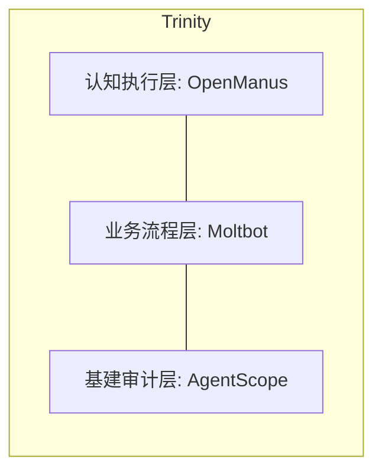
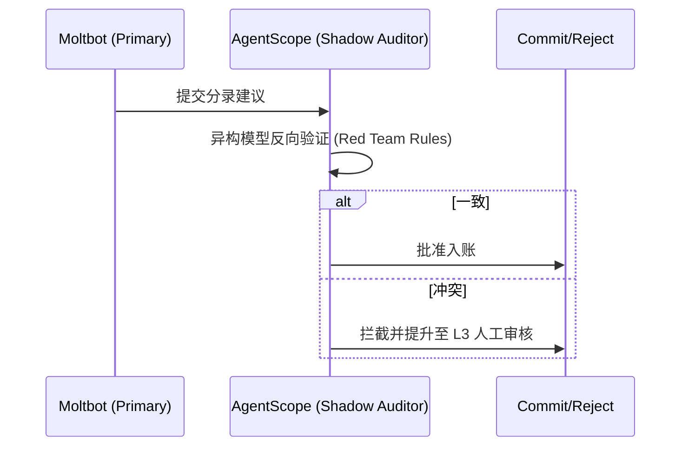

# LedgerAlpha 详细设计说明书 (Detailed Design Specification) - v5.0 Final

## 1. 引言 (Introduction)

### 1.1 编写目的
本文档旨在为 LedgerAlpha (微小企业全自动、自进化记账智能体系统) 的开发提供详尽的架构指导与实现细节。本版本已根据《需求规格说明书 v5.0》及最终代码实现进行修正。

### 1.2 项目背景与架构核心
LedgerAlpha 融合了 AgentScope 的高可用多智能体协作、Moltbot 的高效 SOP 执行以及 OpenManus 的强逻辑推理能力。
- **AgentScope**: 基建、审计、异常捕获。
- **Moltbot**: SOP 流程、IM 交互、低成本 L1 推理。
- **OpenManus**: 异常处理、外部调研、L2 高级推理。

---

## 2. 系统总体架构设计 (Overall Architecture)

### 2.1 逻辑分层模型 (Layered Model)

### 2.2 推理分级机制 (Inference Tiering)
- **L1 (Efficiency Tier)**: 处理 90% 标准化凭证，置信度阈值 0.95。
- **L2 (Advanced Tier)**: 触发 L3 风险或 L1 低置信度时激活。

---

## 3. 核心子系统详细设计 (Subsystem Design)

### 3.1 智能流式采集子系统 (The Collector Subsystem)

#### 3.1.1 影子银企直连 (Shadow Bank-Enterprise Connection)
- **技术实现**：利用 `BaseConnector` 抽象层和 `Collector` 的文件监听机制。支持动态配置 CSV/Excel 映射。
- **安全保障**：所有浏览器操作在本地沙箱运行，凭据通过本地 1Password 或加密 Store 注入。

#### 3.1.2 预记账预匹配 (Shadow Entry Matching)
- **流程**：`SMS/Email Notification` -> `AgentScope PendingEntry Actor` -> `Create Shadow Entry` -> `Await Receipt` -> `Fuzzy Match (Multi-Factor: Semantic + Time)`.

### 3.2 语义记账引擎详细设计 (The Ledger Engine)

#### 3.2.1 影子会计审计逻辑 (Shadow Auditing)

#### 3.2.2 知识自进化与灰度期 (Knowledge Evolution)
- **灰度规则 (Gray Rules)**：新规则需通过 3 次异构审计或人工确认方可转为 `Moltbot SOP` 规则。支持知识蒸馏与冲突合并。

### 3.3 经营分析与税务哨兵设计 (The Sentinel & Analyst)

#### 3.3.1 税务“模拟报税”沙箱 (Tax Sandbox)
- **逻辑**：模拟税务局申报接口，读取真实账目聚合数据，计算预缴税额，并在 IM 端推送“税负压力测试报告”。

#### 3.3.2 智能供应商洞察 (Vendor Intelligence)
- **算法**：对单一供应商执行 `Historical Price Clustering`（历史价格聚类分析），当单价偏离中位数 15% 时触发预警。

---

## 4. 接口协议设计 (Interface Protocols)

### 4.1 IM 寄生交互协议
- **卡片渲染**：使用 JSON 定义标准的 ActionCard v1.2，支持 HMAC 签名与防重放攻击。
- **主动触达**：InteractionHub 作为独立守护进程运行，轮询 Outbox 消息。

---

## 5. 数据存储设计 (Data Storage)

### 5.1 存储增强
- **Inference Graph**: 存储每个分录的完整推理路径（OCR -> Reasoning -> Auditing）。
- **project_tags**: 支持按项目、门店、部门的多维成本核算。
- **Privacy**: 本地数据库存储原始数据，日志与交互层实施脱敏。

---

## 6. 风险控管与异常处理 (Risk & Error Handling)

### 6.1 会计红线阻断
- 任何涉及法人个人借款、大额无票支出、税务预警偏离的任务必须强制人工干预。

### 6.2 成本看板 (Cost Dashboard)
- 实时统计：`Human_Hours_Saved` = `AI_Processed_Count * 5min`。
- 实时统计：`Token_Spend_vs_Budget`。

---
迭代记录：v5.0 Final [2026-01-31]