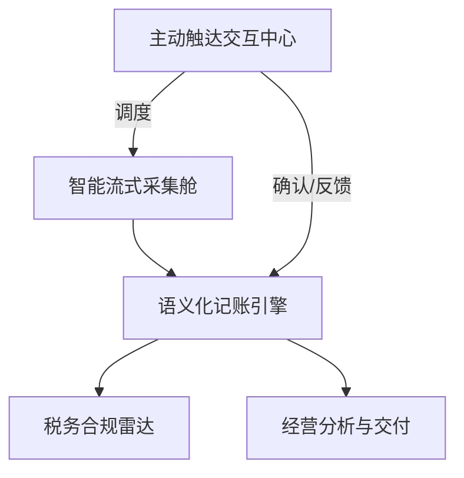

# LedgerAlpha 需求规格说明书 (Software Requirements Specification) - v5.0 Final

## 1. 引言 (Introduction)

### 1.1 编写目的
本文档定义了 LedgerAlpha 系统的功能与非功能需求，旨在为后续的架构设计、任务编排（SOP）以及 Agent 开发提供权威依据。本版本已全面对齐《白皮书 v4.0》及系统最终实现。

### 1.2 项目背景与愿景
LedgerAlpha 是一款为微小企业量身定制的“AI 原生”全自动记账系统。
- **核心痛点**：单据杂、流程繁、税务风险隐蔽、人工成本高。
- **产品定位**：具备会计思维的数字员工。
- **核心能力**：自动采集、智能记账、合规哨兵、经营洞察。

### 1.3 核心技术栈架构 (The Trinity Strategy)
系统采用“三位一体”协作模式：
- **AgentScope**：多智能体基建、异常隔离与多重审计底座。
- **Moltbot**：标准化 SOP 执行、轻量化 IM 交互与低成本流水线。
- **OpenManus**：复杂逻辑推理、自动化浏览器探索与外部政策抓取。

---

## 2. 产品总体概述 (Product Overview)

### 2.1 产品功能模型 (Function Model)

系统由五个核心功能簇组成：
1. **智能流式采集 (The Collector)**：全渠道单据自动抓取与预记账。
2. **语义化记账引擎 (The Ledger Engine)**：自动化科目分类、影子审计与分录生成。
3. **税务风险与合规雷达 (The Sentinel)**：金税四期巡检与模拟报税沙箱。
4. **银企对账与交付机器人 (The Reconciler)**：自动化对账、现金流预报与投融资包生成。
5. **主动触达交互中心 (Proactive Hub)**：基于 IM 的轻量化决策界面，支持主动轮询与证据追索。

### 2.2 推理分级策略 (Inference Tiering)
- **L1 (常规处理)**：处理 >90% 简单任务（如标准化发票），置信度要求 >0.95。
- **L2 (专家处理)**：处理 L1 低置信度任务、复杂合同或高风险（L3）预警任务。

---

## 3. 功能需求详细说明 (Functional Requirements)

### 3.1 智能流式采集模块 (The Collector)
- **F3.1.1 多渠道监听**：支持本地文件夹、企业邮箱 (IMAP)、IM 工具 (微信/飞书) 文件流实时监听。
- **F3.1.2 预记账预匹配**：对标 Brex/Ramp 模式，通过监听银行短信/邮件在发票到达前预生成“影子分录”，实现秒级消消乐匹配。
- **F3.1.3 多模态资产识别**：支持实物拍照识别资产类型并生成卡片，具备多图语义聚合能力，识别空间连续性（如大型设备的多个角度）。
- **F3.1.4 影子银企直连**：利用 Connector 架构与浏览器自动化技术，安全抓取本地化银行流水（无需高昂的 API 成本）。

### 3.2 语义记账引擎模块 (The Ledger Engine)
- **F3.2.1 智能科目匹配**：基于 Universal Dimension Management（多维标签云），自动分配会计科目。
- **F3.2.2 影子会计审计**：每一笔分录必须通过 AgentScope 触发的独立异构审计 Agent 校验。
- **F3.2.3 项目成本归集**：基于单据语义自动打标签并输出项目损益表。
- **F3.2.4 穿透式证据链**：所有报表数字均可溯源至原始 OCR、推理日志及审计记录。支持区块链式哈希校验。

### 3.3 税务合规与经营分析模块 (The Sentinel & The Reconciler)
- **F3.3.1 税务局视角巡检**：模拟金税四期逻辑，巡检进销项匹配度与税负率。
- **F3.3.2 模拟报税沙箱**：基于实时账目生成模拟纳税申报表，提供合规避税建议。
- **F3.3.3 现金流天气预报**：基于历史支出规律与合同付款项，预测未来资金风险及“现金耗尽点”。
- **F3.3.4 投融资标准包一键生成**：导出符合银行贷款或机构融资标准的结构化报告。
- **F3.3.5 智能供应商洞察**：分析供应商采购频率与价格波动，预警涨价风险。

### 3.4 交互与交付模块 (Proactive Hub)
- **F3.4.1 IM 寄生交互**：所有决策通过微信/飞书卡片推送。支持主动追索缺失证据。
- **F3.4.2 HITL 知识回流**：用户手动修正后，系统需进行冲突检测并反哺至 Moltbot 规则库，新规则需经过“灰度期”管理。
- **F3.4.3 版本控制与回溯**：支持“账本快照”及 Audit Trail，可一键回滚。

---

## 4. 非功能需求 (Non-Functional Requirements)

### 4.1 数据安全与隐私
- **脱敏网关**：采用“本地锁死，出口脱敏”策略。数据库存储原始数据以保证匹配精度，日志与外发卡片严格脱敏。
- **本地优先**：敏感数据锁死在本地 Actor。

### 4.2 性能与成本控制
- **推理熔断**：单笔任务成本超阈值需授权。
- **成本看板**：实时展示 AI 节省的人工工时与 Token 费用。

---

## 5. 验收标准 (Acceptance Criteria)

- **准确率**：常规单据处理准确率 >98%。
- **时延**：IM 交互响应 <5s。

---
迭代记录：v5.0 Final [2026-01-31]